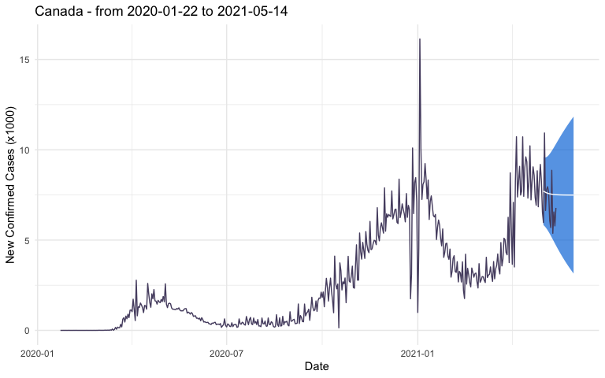

Load required packages

``` r
suppressPackageStartupMessages({
library(forecast)
library(jsonlite)
library(ggplot2)
library(plotly)
})
knitr::opts_chunk$set(
  collapse = TRUE,
  comment = "#>",
  fig.path = ""
)
```

Source the functions

``` r
source("functions.R")
```

Get the table listing the regions/coutries and their slugified ID

``` r
r <- fromJSON("https://hub.analythium.io/covid-19/api/v1/regions")
r$slug
```

Pich an ID, get/process the data, fit/forecast an ETS model

``` r
pred <- "canada-combined" %>%
  get_data() %>%
  process_data(cases="confirmed", last="2021-05-01") %>%
  fit_model() %>%
  predict_model(window=30, level=95)
```

Inspect the forecast and prediction intervals

``` r
head(pred$prediction)
#>           Date PointForecast       Lo       Hi
#> 466 2021-05-02      7714.415 5832.609 9596.222
#> 467 2021-05-03      7675.600 5775.641 9575.559
#> 468 2021-05-04      7643.555 5709.822 9577.287
#> 469 2021-05-05      7617.098 5633.808 9600.388
#> 470 2021-05-06      7595.256 5548.122 9642.390
#> 471 2021-05-07      7577.224 5454.266 9700.182
```

Plot the time series and forecast

``` r
p <- plot_all(pred)
```

``` r
p
```

<!-- -->

Turn the plot into a plotly widget

``` r
ggplotly(p)
```
